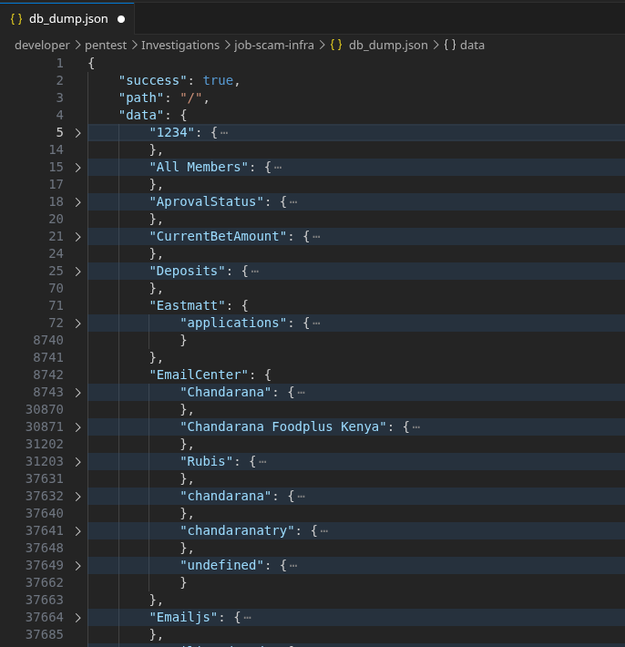
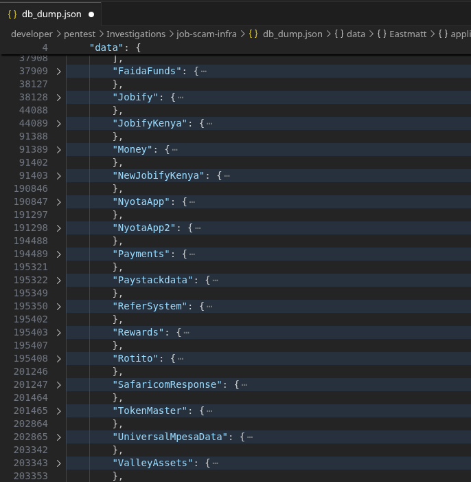
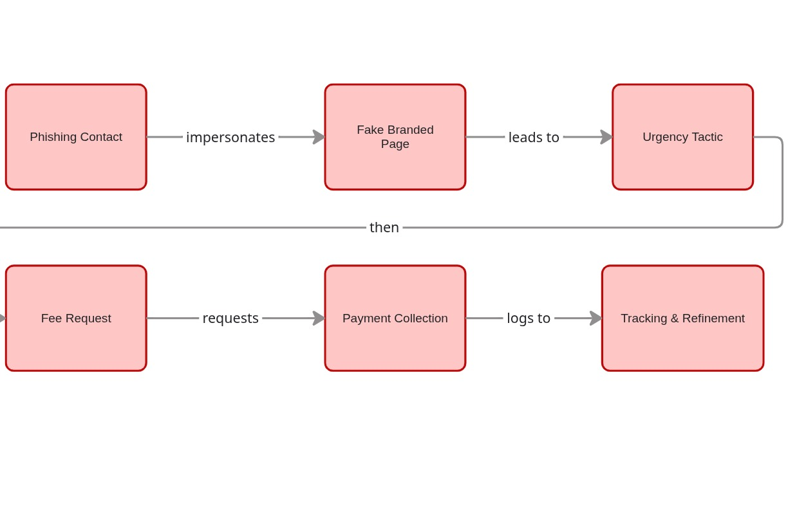
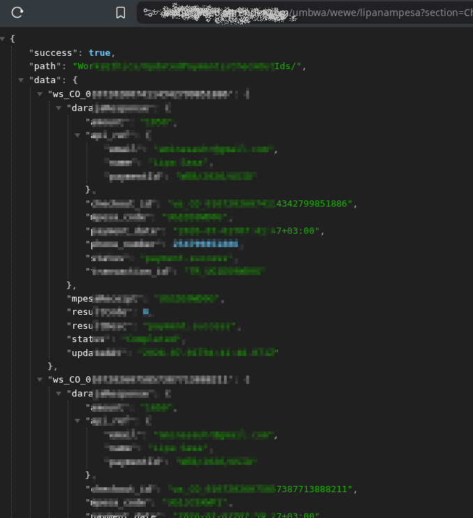

# One Backend, Ten Scams: Inside a Shared Infrastructure Fraud Network Targeting Kenyan Job Seekers

## Executive Summary

If you've applied for a job in Kenya recently and received an email congratulating you on being "shortlisted" for an interview — followed by a request to pay a fee for a certificate before that interview can happen — you may have encountered a piece of the operation described in this report.

Nomad discovered that a single, unsecured piece of backend infrastructure was quietly powering at least ten different scam campaigns at once, each one impersonating a different well-known company. Some promised jobs. One promised loans. Another promised money for referring friends. All of them fed into the same underlying system, and that system had no lock on the door at all — meaning that in the course of investigating one scam, we were able to see the operator's entire toolkit, its victim records, and evidence that real people had already paid real money into it.

This report explains what we found, how confident we are in each piece of it, and what it means for anyone applying for jobs online in Kenya today.

<!-- placeholder: cover image / hero graphic -->

## Background

The investigation began the way most people encounter this kind of thing: with an email. It described a job application, congratulated the recipient on being shortlisted, and named a real, recognizable employer. The letter set an interview date and, notably, listed "salary negotiation" as the very first item on the interview agenda — before any actual interview had taken place.

The email then asked for a set of documents to be submitted ahead of the interview. Most were standard (ID, academic certificate). One was not: a "Work Ethics Clearance," described as a government labour requirement, obtainable only through a specific external website — for a fee.

This shape is a well-established one in Kenya: a scam that mimics a real hiring process closely enough to feel legitimate, then introduces a paid step that a genuine employer would never require. What made this instance worth a closer look wasn't the scam script itself — it's a familiar one — but a technical detail. The page delivering the fake offer letter loaded its content dynamically from a backend server, and that server was reachable directly, without going through the front-end page at all.

## The Investigation

### Initial Observation

Reviewing the offer page's client-side code (a routine step when evaluating any unsolicited message before deciding how to respond to it) revealed the web address of the backend server responsible for populating the letter with a name, a job title, and an interview date. That backend accepted plain web requests with no login, no token, and no session of any kind.

### Research Questions

The investigation set out to answer three questions:

1. Is this a single scam, or part of something larger?
2. What actual harm has already occurred, and to how many people?
3. What is the fastest way to reduce further harm, given what's been found?

### Scope

This research is limited to what could be observed by making ordinary, unmodified requests to a server that was already returning data to any caller, with no login required. No attempt was made to bypass any security control, because none existed to bypass. No credentials were guessed. No data was altered beyond a single automated tracking update that the phishing page itself triggered when its link was clicked — a normal part of how the scam's own analytics worked, not an action taken by the investigator.

### Investigation Approach

Once it became clear that this was not a company's legitimate system with a flaw in it, but infrastructure built specifically to run scams, the investigation shifted to a strict passive-observation posture: read what the server offers, do not interact with it beyond that, and prioritize getting actionable information to people who could stop ongoing harm over continuing to explore for its own sake.

Nomad does not publish the specific request patterns used to reach this data. The goal of this report is to inform and protect, not to hand out a reproduction guide.

### Evidence Collection

Evidence was collected exclusively from server responses returned during passive review, including timestamps already present in the data (allowing a timeline to be reconstructed without needing to actively monitor the system over time).

## What We Found

### Finding 01 — The backend had no authentication of any kind

**Observation:** Every data endpoint on the backend, including a request that returned the server's entire dataset in one response, could be reached by anyone, with no credentials required.

**Evidence:** Ordinary, unmodified requests consistently returned full data records. Malformed or incomplete requests were not rejected outright — they returned partial or placeholder data, indicating no validation layer exists at all.

**Significance:** This single gap is the reason everything else in this report was possible to observe. A system with no lock on the door doesn't just expose one scam — it exposes everything sharing that door.

**Confidence:** Confirmed.

<!-- placeholder: redacted screenshot of an unauthenticated request/response -->

### Finding 02 — The paid "certificate" at the center of the largest scheme does not functionally exist

**Observation:** The fee-based certification victims were asked to pay for is checked against a verification system that does not work.

**Evidence:** A direct test of the certificate verification endpoint, using a real certificate number generated by the scam's own system, returned a failure — the system could not verify a credential it had itself just issued.

**Significance:** This removes any ambiguity about intent. A legitimate certification process, even a flawed one, would be able to verify its own output. One that cannot is not a certification process; it is a payment collection mechanism with a certificate-shaped wrapper.

**Confidence:** Confirmed.

### Finding 03 — One backend served at least ten simultaneous scam campaigns

**Observation:** The same infrastructure, data model, and request pattern powered independent-looking campaigns impersonating at least six real, named companies, plus several unbranded schemes (a fee-based loan service, a referral/rewards scheme, and a broader app-style platform with its own account system).

**Evidence:** All campaigns were reachable through the same backend, using the same route structure, and were visible together in a single full-dataset response.

**Significance:** This is not six unrelated scams that happen to look similar. It is one operation running a repeatable template against many targets at once, which means shutting down any single branded front end would not meaningfully disrupt the operation — the infrastructure underneath would remain intact and reusable.

**Confidence:** Confirmed.

<!-- placeholder: diagram - one backend, multiple campaign "skins" -->

### Finding 04 — Thousands of victims' personal data was exposed in plaintext

**Observation:** Full personal records — names, national ID numbers, phone numbers, and account passwords — were stored and returned without any encryption or hashing.

**Evidence:** Sample records returned during passive review contained readable, plaintext password fields alongside other identifying information. Across the largest single campaign alone, over two thousand such records were present.

**Significance:** Beyond the immediate scam, plaintext password exposure at this scale creates downstream risk for victims well beyond this incident — anyone who reused one of these passwords elsewhere is now exposed to account takeover attempts unrelated to the original scam.

**Confidence:** Confirmed.

### Finding 05 — Real financial harm is already occurring, and was ongoing at time of discovery

**Observation:** Payment records tied to the certificate scheme show a substantial number of successful transactions, with activity as recent as the day of discovery.

**Evidence:** Timestamped transaction records within the exposed data showed a pattern of payments beginning several weeks prior to discovery and continuing without interruption through the investigation window.

**Significance:** This is not a dormant or historical scheme. People were being charged in the days immediately surrounding this investigation, which shaped the decision to prioritize fast-acting reports (to payment and email providers) over slower channels.

**Confidence:** Confirmed.

### Finding 06 — Indicators suggest a single operator or small group behind multiple campaigns

**Observation:** Certain identifying details recur across what otherwise appear to be independent campaigns, in a pattern consistent with an operator testing their own tools using personal information before wider deployment.

**Evidence:** Repeated, non-victim-context appearances of the same limited set of identifiers across several of the campaigns' internal records.

**Significance:** If accurate, this suggests the campaigns are run by a small, centralized group rather than many unrelated actors independently copying a successful template. This has implications for how effectively a single law enforcement action could disrupt the broader operation.

**Confidence:** Unconfirmed. Nomad is deliberately not publishing the specific identifiers here. This is an investigative lead that has been shared with law enforcement for independent corroboration, not a conclusion about any individual's identity, and treating it as more certain than that risks real harm to someone if the pattern has an innocent explanation (e.g., reused test data, a shared device, or a compromised identity used without its owner's knowledge).

## The Fraud Chain

The operation follows a consistent chain across its campaigns:

1. **Contact** — A phishing message (email or SMS) impersonating a real, recognizable employer or service, congratulating the recipient on a shortlisting, approval, or opportunity they did not actually earn.
2. **Legitimacy signaling** — A branded landing page, often using the real company's logo and a plausible-sounding staff name, reinforces trust.
3. **Manufactured urgency** — A short deadline (commonly 48 hours) and a warning of disqualification pressure the recipient into acting quickly rather than verifying independently.
4. **The paid step** — A fee is introduced, framed as a mandatory, official-sounding requirement (a certificate, a clearance, a processing charge).
5. **Payment collection** — The fee is collected via mobile money, routed through intermediary payment infrastructure.
6. **Tracking and iteration** — The system logs engagement (link clicks, views, follow-through) allowing the operator to measure and refine which messages convert best.

<!-- placeholder: flow diagram of the fraud chain -->

## Impact

**Individuals:** Thousands of job seekers have had sensitive personal data exposed, and a smaller but significant number have lost real money to a product that does not exist. Beyond the immediate financial loss, exposed plaintext passwords put victims at risk of further compromise anywhere they reused that password.

**Businesses:** At least six real, established companies have had their names and hiring processes impersonated without consent or knowledge, creating reputational exposure and applicant distrust they did not cause and cannot easily control.

**Public trust:** Every successful scam of this kind makes the next legitimate hiring email a little harder to trust. At the scale observed here — a reusable template deployed against many brands — the cumulative erosion of trust in online job applications is a real, if harder to measure, cost.

**Infrastructure:** The exposure of live third-party service credentials (payment gateway and email service access) within the same unsecured system means the risk isn't limited to this operator alone — anyone else who found the same exposure could have used those credentials for entirely separate abuse.

**If the pattern continues:** The core enabling factor here — one piece of reusable, unsecured infrastructure serving many scam "skins" — is not unique to this operation. The same approach could resurface under new branding even if this specific instance is taken down, unless the underlying pattern is recognized and reported quickly when seen again.

## What We Learned

- **A single unsecured backend can be a bigger story than the scam that leads you to it.** The initial phishing email was a familiar, almost unremarkable scam. The infrastructure behind it was not.
- **Fee-based "certification" or "clearance" requirements attached to a job offer are a reliable red flag**, regardless of how official-sounding the requirement is. No legitimate Kenyan employer requires an applicant to pay for a credential as a condition of interviewing.
- **Scam operations increasingly reuse infrastructure across brands.** Recognizing the pattern (a too-fast timeline, a mandatory paid step, a personal-sounding but generic recruiter contact) matters more than recognizing any one brand being impersonated, because the branding is the part most likely to change next.
- **Passive, disciplined observation can surface actionable intelligence without crossing ethical or legal lines**, even when a system is wide open. Restraint — not exploiting what's available just because it's available — was as important to this research as the technical discovery itself.

## Recommendations

**For job seekers:**
Treat any request for payment tied to a job application — regardless of what it's called — as disqualifying, not reassuring. Verify unexpected job offers by contacting the company directly through channels you find independently, not ones provided in the offer itself.

**For the companies being impersonated:**
Monitor for spoofed recruitment communications using your brand, and consider a standing public notice (e.g., "we never charge applicants fees") that applicants can check against.

**For platform and hosting providers:**
Backend services returning full, unauthenticated data exports at a single endpoint are a systemic risk multiplier — a review process that specifically checks for this pattern would catch not just this operation but similar ones built the same way.

**For payment and communication service providers:**
Rapid credential revocation processes matter — in this case, the fastest available lever to reduce ongoing harm was the third-party providers whose credentials were exposed, not the platform hosting the scam itself.

## Disclosure & Response

This research does not involve disclosing a previously unknown vulnerability in a legitimate organization's systems — the infrastructure investigated was purpose-built for fraud, not a company's own platform with a flaw in it.

That said, several parties with the ability to reduce ongoing harm were contacted as part of this investigation:

- **Affected third-party service providers** (payment gateway and transactional email services) were notified of exposed live credentials, with a request for immediate revocation.
- **The mobile money operator's fraud desk** was notified of the payment collection mechanism.
- **National cybercrime authorities** were provided a full evidence package covering the scope of the operation.
- **The real companies being impersonated** were notified so they could warn their own applicant communities directly.

Responses from these parties were pending at the time of publication. This report will be updated if that changes.

## Conclusion

What began as one more job-scam email in an inbox turned out to be a window into something considerably larger: shared, reusable, and completely unsecured infrastructure powering an entire family of fraud campaigns at once. The individual scam script here isn't new. What's worth paying attention to is the pattern underneath it — one operator, one system, many masks — because that pattern is built to outlast any single takedown.

## Sources & Evidence

Primary evidence for this research consists of timestamped server responses collected during passive review of the backend described above, including transaction records, applicant data structures, and service configuration data. Identifying details of individual victims have been withheld or redacted throughout this report and are not reproduced here. Specific request patterns used to access this data have also been withheld to avoid providing a reproduction guide.

Full technical evidence, including the unredacted dataset, has been shared exclusively with the law enforcement and provider contacts named above and is not published as part of this report.

<!-- placeholder: redacted evidence screenshots -->

<!-- placeholder: archived copy of phishing landing page (sanitized) -->
